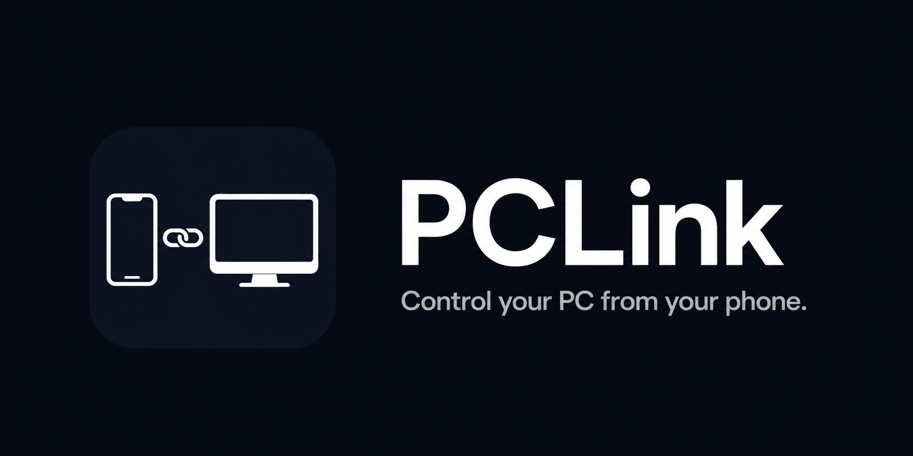

  

<h1 align="center">PCLink Agent</h1>

The Windows agent for the PCLink mobile app — control your PC from your phone.

---

## What is PCLink?

PCLink is a mobile app that lets you remotely control your Windows PC from your iPhone or iPad over your local Wi-Fi network. Wake your PC, shut it down, lock it, launch apps, control volume, set scheduled events, and more — all from your phone.

## This Repository

This repo contains the **PCLink Agent** — the Windows background service that runs on your PC and communicates with the PCLink mobile app.

## Download

👉 **[Download the latest PCLink Agent for Windows](https://github.com/laikxn/pc-control-server/releases/latest)**

## Requirements

- Windows 10 or later
- PCLink app on iPhone or iPad (available on the App Store)
- Both devices on the same Wi-Fi network

## Installation

1. Download `PCLink-Agent.exe` from the [latest release](https://github.com/laikxn/pc-control-server/releases/latest)
2. Run it — if Windows shows a SmartScreen warning click **More info** → **Run anyway**
3. The agent will appear in your system tray
4. Open the PCLink app on your phone and follow the pairing instructions

## Features

- 🖥 **Remote Control** — Wake, shutdown, restart, and lock your PC
- ⚡ **Custom Actions** — Launch any app or script from your phone
- 📅 **Scheduled Events** — Automate actions at set times
- 🎬 **Scenes** — Run multiple actions with one tap
- 🔊 **Volume Mixer** — Control your PC's volume and individual app volumes
- 📊 **System Stats** — Monitor CPU, RAM, and GPU usage in real time
- 🔒 **Secure** — Token-based local network authentication, no data ever leaves your network

## Privacy

PCLink does not collect any data. Everything stays on your local network. See our [Privacy Policy](https://pclink.app/privacy).

## Support

For help or feedback, contact us at support@pclink.app

---

© 2025 PCLink

